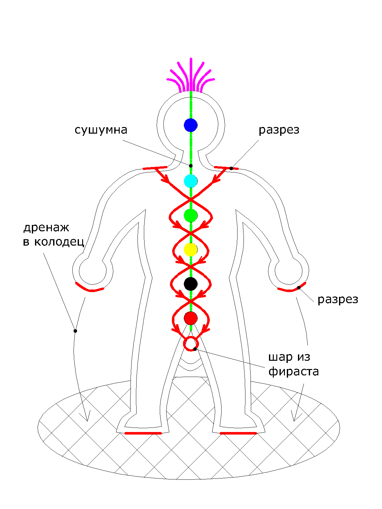
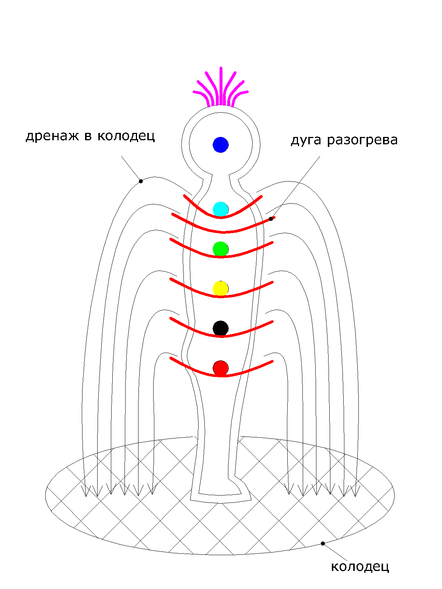
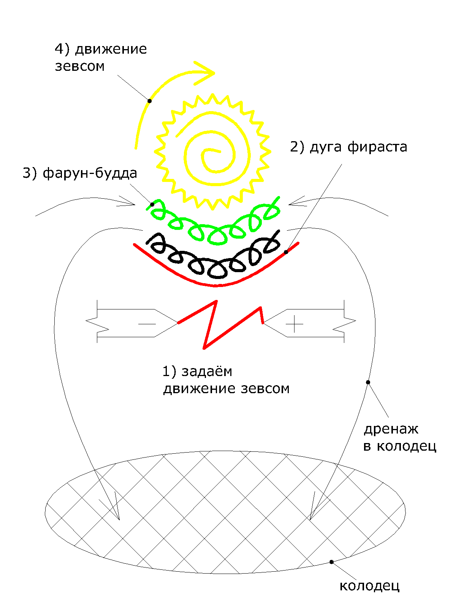
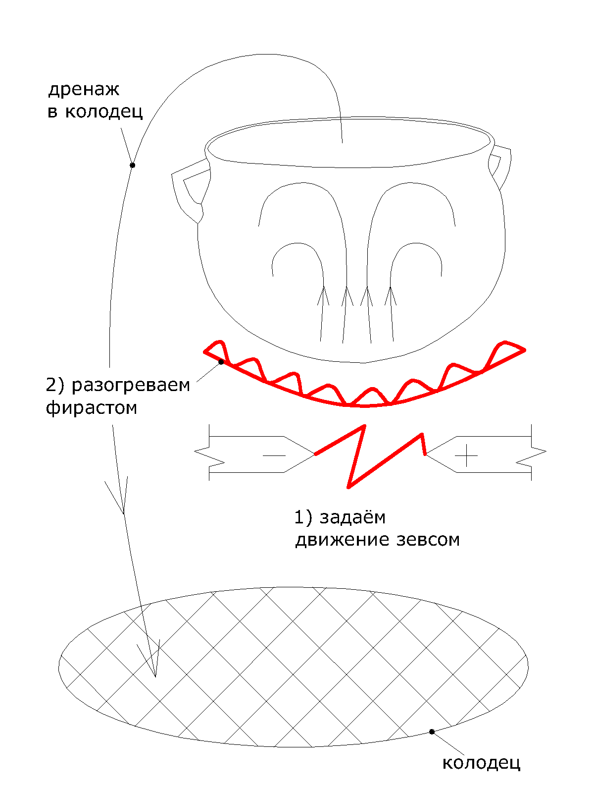
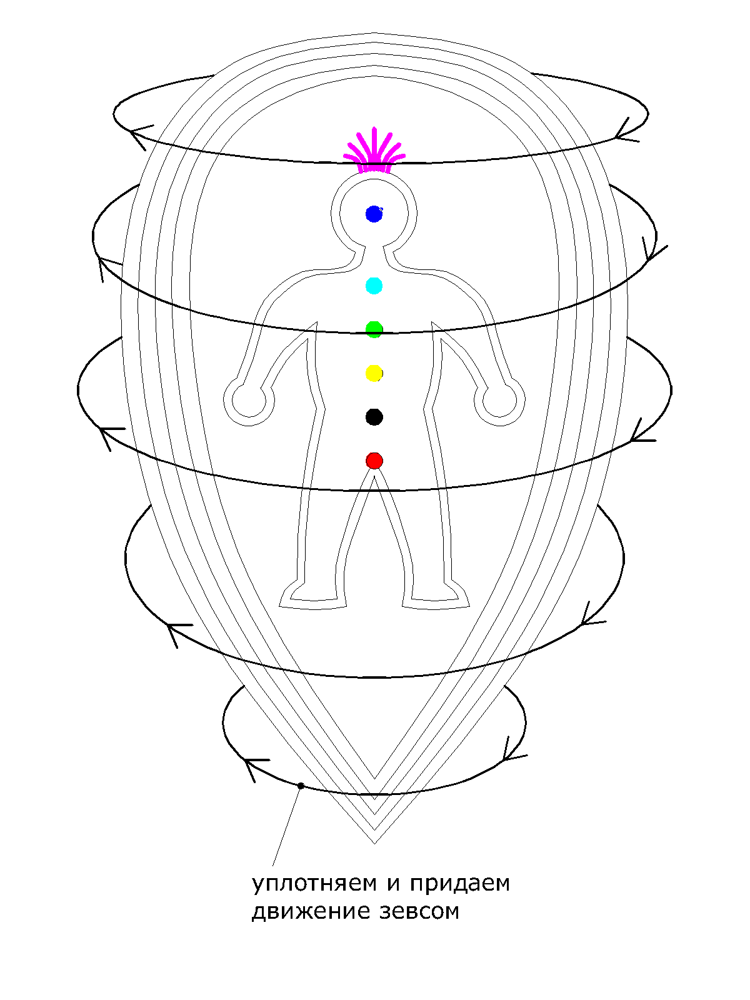

# Техника проведения сеанса

Открытие колодца

Прежде чем говорить о том, как работать с энергией каналов, нам следует выяснить что делать с энергией после её использования. Для утилизации лишней и отработанной энергии мы используем такой инструмент как «Колодец».

Колодец представляет собой место, содержащее внутри себя огонь и жар, без остатка сжигающий и уничтожающий весь негатив, который попадает к нему внутрь. Условно, Колодец можно сравнить с порталом к центру земли, где под влиянием предельно высоких температур и давления, любая негативная энергия моментально, безусловно и окончательно уничтожается.

Колодец можно открывать как на всю комнату, так и меньшего размера. Сверху колодец защищён решёткой, с достаточно частым шагом что бы по ней можно было беспрепятственно ходить, и покрыт энергетическим слоем для защиты.

Дренаж

Для отвода негативной, отработанной и лишней энергии мы используем такой инструмент как «Дренаж».

Дренаж представляет из себя сформированный из энергии канала шланг, по которому удобно и безопасно отводить негатив в колодец.

**Техника проведения сеанса**

Перед началом сеанса не лишним будет немного успокоиться и вернуться в настоящий момент — медитация на 15-20 минут вполне подойдёт для этих целей.

Так же, пришедший к вам человек, хотя и находится у вас телом, но умом своим может ещё пребывать на работе, в каких-либо домашних делах, прошедших событиях или будущих планах. Можете попробовать обсудить с ним, буквально на пару минут, какие-либо нейтральные темы. Например, погоду или ещё что-то — что бы помочь ему отвлечься от гнетущих его дум и лучше расслабиться на сеансе. По завершении сеанса так же следует выделить 5-10 минут, что бы человек мог спокойно прийти в себя.

Очень важно чётко осознавать цель сеанса, обычный ли это лечебно-оздоровительный сеанс, работаем ли мы с каким-либо конкретным недугом — всё это вам нужно определить для себя заранее и работать во время сеанса в конкретно заданном направлении.

Необходимым моментом в проведении сеанса является уверенность. Не стоит поддаваться беспокойству о том, что вы ещё не готовы, у вас ещё мало опыта или знаний — судьба довольно редко допускает ошибки, и если уж случилось так что вы посвящены, то провести сеанс у вас получится обязательно.

Если во время сеанса приглушить свет, включить негромкую расслабляющую музыку, зажечь свечи и воскурить благовония — то всё это так же поспособствует расслаблению пациента.

Может так случиться, что на сеансе у пациента закружится голова. Нужно заранее позаботиться, чтобы позади пациента во время сеанса стоял стул, на который он может сесть. Если же человеку станет совсем плохо — то сеанс можно прекратить досрочно. Досрочно сеанс завершать следует так же, как и в обычном порядке, это будет описано ниже.

**Рассмотрим проведение базовой части сеанса**

Итак, мы соблюли все формальности и прелюдии. Начинать сеанс следует с установки для пациента: **«Расслабьтесь, закройте глаза, и глаза откроете в конце сеанса, когда я скажу "сеанс окончен". Вы откроете глаза и будете здесь и сейчас»**.

Во время работы необходимо создавать в воображении мыслеобраз канала, полученный при посвящении, произносить мантры этого канала \(произносить следует про себя\) и вспоминать ощущения от канала. Производить эти действия необходимо синхронно.

Первым делом, открываем каналы на чистку помещения в котором мы находимся. Когда каналы «пошли», открываем Колодец на всю комнату и выделяем 5-10 минут на очищение помещения.

Когда помещение очищено, открываем лотос у пациента. Накачиваемся каналом Фираст, и прочищаем каналы Ида и Пингала пациента. Для этого «прокалываем» каналы в районе ключицы и прокачиваем их Фирастом. Под первой чакрой формируем шарик из Фираста, который подымаем вверх по Сушумне \(вдоль позвоночника\). Этот шарик из Фираста мы выводим в колодец через верх по каналу Сушумна. Схематичное изображение этого процесса можно увидеть на рисунке 1.

Далее, каналом Фираст, делаем разрезы в эфирном теле пациента в районе ключичных костей, разрезы в районе кистей и в районе стоп. Мягко прокачиваем Фирастом ауру межу 4 и 5 чакрой в верхней части грудины. Суть этой процедуры заключается в том, чтобы последующие 20 минут сеанса энергия этого канала заходила в эфирное тело пациента и гармонизировала энергетику человека. Места разрезов так же указаны на рисунке 1.

**Работа с чакрами**

Одной из основных составляющих сеанса является работа с чакрами. В ходе этого процесса нам необходимо разогреть чакру, раскрутить её, отвести тяжелую энергию и накачать чистую энергию канала.

Разогреть чакру можно дугой из канала Фираст. Для этого _**под чакрой**_ каналом Зевс задаём движение и искру, и зажигаем дугу из канала Фираст. Дуга Фираста должна располагаться _**непосредственно под чакрой**_ \(схематичное изображение этого и последующих действий с чакрами можно посмотреть на рисунке 2\).

После того, как мы разожгли дугу разогрева – следует раскрутить чакру каналом Зевс, и накачать под чакру свежую энергию канала Фарун-Будда или другого канала, в зависимости от цели сеанса.

В процессе разогрева и раскрутки чакры, с её поверхности слоем сходит тяжелая энергия и оседает на дуге разогрева. Эту тяжелую неблагоприятную энергию необходимо вывести дренажами в колодец.

Таким образом следует работать с чакрами с первой по пятую. Вибрации шестой и седьмой чакры очень тонкие и для работы с ними есть свои техники, которые будут описаны ниже. Вибрации четвёртой и пятой чакр так же довольно тонкие, поэтому работать с ними нужно аккуратно и не перегревать.

Главная цель при работе с чакрами – добиться равномерного разогрева, чистоты и скорости вращения чакр.

После того, как мы зажгли дугу, раскрутили и накачали все пять чакр – оставляем человека чиститься ещё на 10-15 минут.

**Чистка головы «Кипящее серебро»**

Следующим этапом, после работы с чакрами, следует чистка головы методом «кипящее серебро». Во время этой процедуры голову пациента следует представлять, как котёл с кипящим серебром. Подогреваем котёл Фирастом, с кипением тяжелая неблагоприятная энергия поднимается вверх и скапливается у горловины котелка, откуда её посредством дренажа необходимо вывести в колодец. Схематично этот процесс изображён на рисунке 4.

**Завершение сеанса**

При завершении сеанса необходимо закрыть колодец, заклеить «пластырем» из канала Фарун-Будда разрезы, сделанные нами в тонком теле пациента и накачать энергию канала Фарун-Будда в ауру пациента. Или другим каналом, если мы дальше работает с каким либо заболеванием пациента.

После этого ауру необходимо выровнять, уплотнить и придать движение каналом Зевс. Схематичное изображение данной процедуры показано на рисунке 5.

Когда аура будет уплотнена, приглушить музыку и вывести пациента из сеанса: **«Делаем глубокий вдох, и на выдохе открываем глаза. Сеанс окончен – Вы находитесь здесь и сейчас»**.

