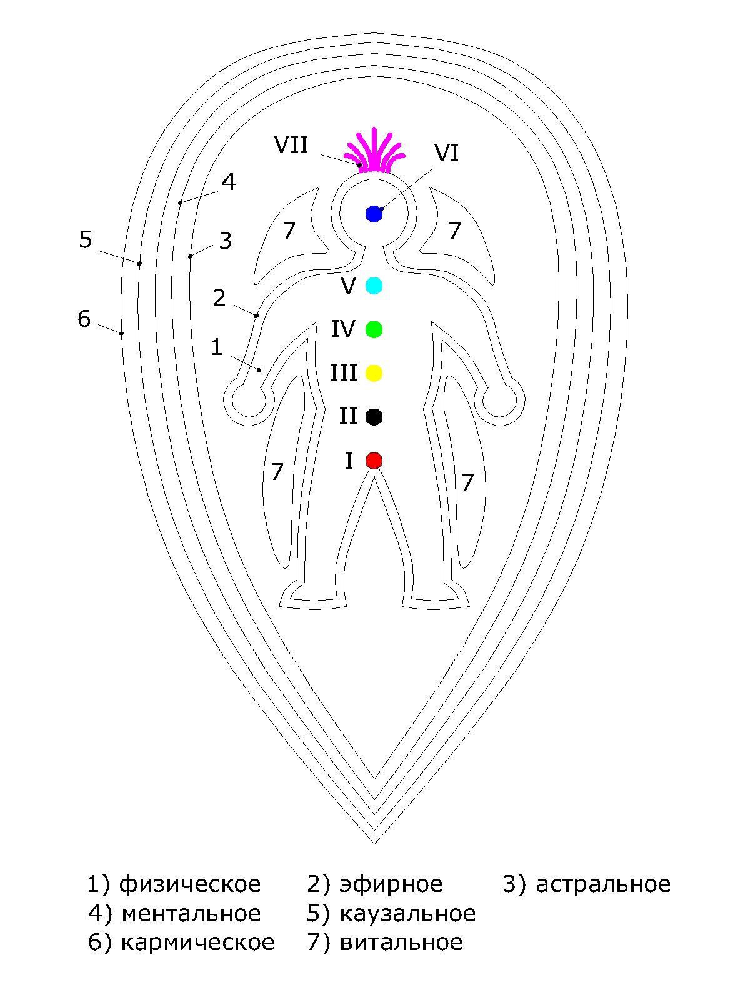

# Техника проведения сеанса

**Чакры**

Аналогично тому, как разветвленная нервная система отвечает за восприятие физического мира, тонкая энергетическая система регулирует эмоциональное, интеллектуальное, психологическое и духовное существование людей. Эта энергетическая система, называемая также тонким телом, состоит из каналов, осуществляющих токи энергии. Эти каналы, согласно Ведическим знаниям называются, надии. Циркуляция крови, нервные импульсы, рост и обновление клеток – всё процессы в теле происходят за счет движения энергии по каналам. В организме каждого человека их великое множество, однако, существует три основных канала - левый \(ида\), правый \(пингала\) и центральный \(сушумна\). Они связывают между собой различные чакры \(энергетические центры\) нашего тонкого тела. Правый энергетический канал назван солнечным он олицетворяет собой мужское начало. Левый энергетический канал назван лунным он олицетворяет собой женское начало. Особенности жизни в современном обществе приводит к целенаправленному засорению левого и правого каналов ненужной информацией. Из-за деформации в этих каналах соответственно перекрывается проход в центральном канале. При такой забитости каналов нарушается работа чакр и затрудняется прохождение энергии. 

_Чакры_, или энергетические центры, находятся на пересечениях основных каналов. Каждая чакра является сосредоточением энергии, порождающей определенные эмоции и желания. Кроме того, эта энергия питает психофизиологические процессы, проистекающие в области тела, за которую отвечает данная чакра. Каждая чакра имеет свой цвет, определенное расположение, связь с элементами, а так же связь с определенной планетой. Поговорим подробнее об основных семи чакрах, расположенных вдоль позвоночного столба.

**Первая** _чакра_ \(Муладхара\) - темно-красный четырех лепестковый лотос, находится в основании позвоночника. 

Первоэлемент, которым управляет данная _чакра_ – _Земля_. Это воплощение материального мира, силы притяжения, силы трансформации энергии в форму. Эта _чакра_ связана с инстинктами самосохранения и выживания. Муладхара означает корень, основа, она закладывает основу для деятельности остальных _чакр_, а также для нашего существования и развития. Она связывает нас с землей, оберегая питающую нас и дающую нам жизнь связь с этим источником энергии. С пробуждением этой _чакры_, энергия, дремлющая в основании позвоночника, начинает подниматься вверх, питая и наполняя все _чакры_. Если данный центр наполнен, то находящаяся в нем энергия проявляет себя как энтузиазм, желание жить и делать что-то. В таком случае человек ощущает себя связанным с жизнью, испытывает ощущение стабильности, самоудовлетворение и чувство внутренней силы. Есть уверенность в возможности легко преодолевать конфликтные и тяжелые ситуации. Аналогичным образом отсутствие энтузиазма, апатичность, вялость означают недостаток энергии в данном центре. Кроме того, человек, испытывающий недостаток энергии в первой чакре будет слишком сильно сконцентрирован на обеспечении основных физиологических потребностях, его не будет интересовать ничего, кроме основных принципов самосохранения – сон, еда, убежище  и возможность создания потомства.  Человек будет изо всех сил стараться удовлетворить свои желания без учета последствий своих действий, а так же мнений, желаний и чувств других людей. Может появиться животный страх от возможности потери чего-то материального, незащищенности.    
  

