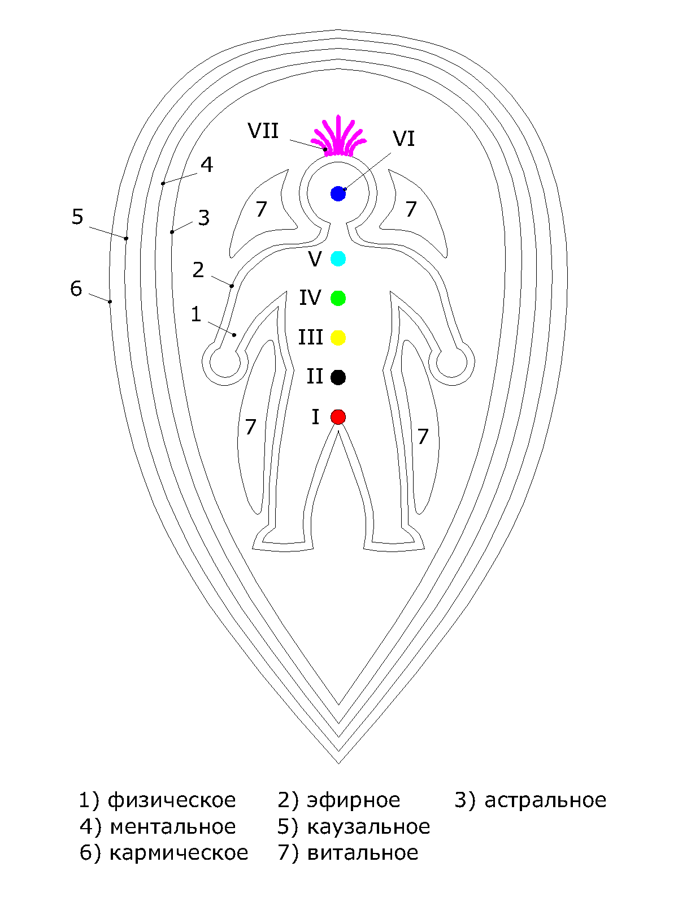

# Тонкое тело человека

Аналогично тому, как разветвленная нервная система отвечает за восприятие физического мира, тонкая энергетическая система регулирует эмоциональное, интеллектуальное, психологическое и духовное существование людей. Эта энергетическая система, называемая также тонким телом, состоит из каналов, осуществляющих токи энергии. Эти каналы, согласно Ведическим знаниям называются, _надии_. Циркуляция крови, нервные импульсы, рост и обновление клеток – всё процессы в теле происходят за счет движения энергии по каналам. В организме каждого человека их великое множество, однако, существует три основных канала - левый \(_ида_\), правый \(_пингала_\) и центральный \(_сушумна_\). Они связывают между собой различные чакры \(энергетические центры\) нашего тонкого тела. Правый энергетический канал назван солнечным он олицетворяет собой мужское начало. Левый энергетический канал назван лунным он олицетворяет собой женское начало. Особенности жизни в современном обществе приводит к целенаправленному засорению левого и правого каналов ненужной информацией. Из-за деформации в этих каналах соответственно перекрывается проход в центральном канале. При такой забитости каналов нарушается работа _чакр_ и затрудняется прохождение энергии.

                                             ВИДЫ ТОНКИХ ТЕЛ: 

